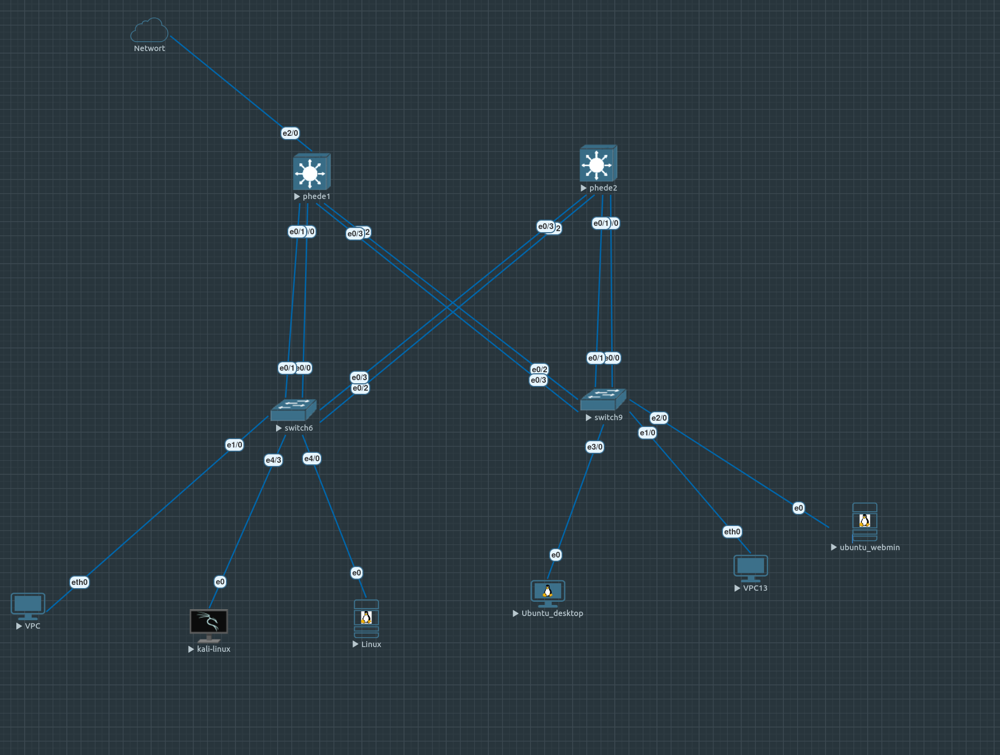

# 🔐 EVE-NG Network Security & Pentest Lab

> **Enterprise network pentest lab** — Real-world attack scenarios from GUEST VLAN to internal services with full documentation

---

## 📋 Quick Overview

This is a **complete network security lab** built in **EVE-NG** that simulates a realistic enterprise campus network and demonstrates real attack paths. It combines:

- ✅ **Hardened network design** — VLANs, RSTP, EtherChannel, HSRP redundancy
- ✅ **Realistic attack vectors** — VLAN hopping, service exploitation, lateral movement
- ✅ **Full documentation** — Step-by-step exploitation with screenshots and commands
- ✅ **Proof of concept** — Working attacks with mitigation strategies

**Perfect for**: Learning enterprise network security, understanding attack scenarios, or CCNA/security certifications.

---

## 🏗️ Network Architecture

### Topology Overview



The infrastructure is designed with a hierarchical campus network structure:

### Key Components

| Component | Details |
|-----------|---------|
| **Layer 3 Switches** | Phede-1, Phede-2 (Distribution tier) — HSRP active/standby per VLAN |
| **Layer 2 Switches** | SW1-SW4 (Access tier) — Client connectivity |
| **VLANs** | 10=RG, 20=MARKETING, 30=DRH, 40=GUEST (test network) |
| **Redundancy** | RSTP + EtherChannel (LACP) + HSRP load sharing |
| **Attack Source** | Kali Linux in GUEST VLAN (isolated but exploitable) |

---

## 🛡️ Redundancy & High Availability

### Mechanisms Implemented

| Mechanism | Purpose | Status |
|-----------|---------|--------|
| **RSTP** | Loop prevention | ✅ Configured & tested |
| **EtherChannel** | Link aggregation (LACP) | ✅ 2x EtherChannels |
| **HSRP** | Gateway redundancy | ✅ Load-balanced per VLAN |
| **DHCP Relaying** | DHCP across VLANs | ✅ Verified |
| **VTP** | VLAN synchronization | ✅ Working |

### HSRP Configuration

| VLAN | Primary | Standby | Virtual IP |
|------|---------|---------|-----------|
| 10   | Phede-1 | Phede-2 | 192.168.10.254 |
| 20   | Phede-1 | Phede-2 | 192.168.20.254 |
| 30   | Phede-2 | Phede-1 | 192.168.30.254 |
| 40   | Phede-2 | Phede-1 | 192.168.40.254 |

**Result**: Automatic failover tested — network stays up even if primary router fails.

---

## 🎯 Attack Scenarios & Exploitation

This lab demonstrates **real attack paths** with full documentation. Each scenario includes commands, expected output, and screenshots.

### Phase 1: Reconnaissance (Internal Network)
```bash
# From Kali (GUEST VLAN)
nmap -sn 192.168.0.0/16              # Network discovery
arp-scan -l                           # ARP sweep to find active IPs
nmap -sV 192.168.10.0/24              # Service enumeration
```
**Output**: Discovers web services, SSH, DHCP servers across VLANs

### Phase 2: Service Exploitation
**Target**: Webmin service (common in enterprise)

```bash
# Brute force weak credentials
hydra -l admin -P wordlist.txt -s 10000 192.168.10.10 http-post-form
# Gain shell access → foothold on internal network
```

### Phase 3: Lateral Movement & VLAN Pivot
```bash
# From compromised host, pivot to other VLANs
route -n                             # Check routing table
arp -a                               # Find default gateway
# Use HSRP spoofing or VLAN hopping techniques
```

### Phase 4: VLAN Hopping Attack ⚡

**Scenario**: Break out of restricted GUEST VLAN to access sensitive VLANs (RG, MARKETING, DRH)

**Techniques**:
1. **DTP Exploitation** — Switch from Dynamic Trunking Protocol
2. **VLAN Hopping** — Double-tag 802.1Q frames
3. **HSRP Spoofing** — Become default gateway

**Proof of Concept**:
```bash
# VLAN hopping with vlan_hop.py
python3 vlan_hop.py -i eth0 -v 20   # Jump to VLAN 20 (MARKETING)
# Now accessible to previously restricted services
```

**Result**: Attacker gains access to internal VLANs from GUEST network

### Phase 5: Findings & Mitigation

| Vulnerability | Severity | Mitigation |
|---|---|---|
| Weak Webmin credentials | 🔴 CRITICAL | Enforce strong MFA, disable Webmin on public IPs |
| DTP enabled on access ports | 🔴 CRITICAL | Disable DTP: `switchport mode access` |
| VLAN hopping possible | 🟠 HIGH | Use 802.1Q native VLAN protection, ACLs |
| No port security | 🟠 HIGH | Enable: `switchport port-security` |
| Unencrypted services (HTTP, SSH weak creds) | 🟠 HIGH | Enforce SSH keys, disable HTTP |

---

## 📁 Repository Structure

```
eve-ng-network-security-lab/
├── README.md                          # This file
├── network-diagram.png                # Visual topology
│
├── configs/                           # Device configurations
│   ├── phede-1.cfg                   # L3 Switch 1 (Distribution)
│   ├── phede-2.cfg                   # L3 Switch 2 (Distribution)
│   ├── sw1.cfg  ... sw4.cfg          # Access switches
│   └── README-CONFIGS.md             # Setup guide
│
├── eve-ng/                            # EVE-NG project files
│   ├── topology.unl                  # EVE-NG lab file (import this)
│   └── startup-commands.txt          # Quick lab initialization
│
├── pentest/                           # Attack documentation
│   ├── 00-scenario.md                # Lab objectives & context
│   ├── 01-recon.md                   # Reconnaissance phase
│   ├── 02-service-scan.md            # Service enumeration
│   ├── 03-webmin-exploit.md          # Webmin exploitation
│   ├── 04-pivoting.md                # Lateral movement
│   ├── 05-vlan-hopping.md            # VLAN hopping attack ⭐
│   ├── 06-findings.md                # Vulnerabilities & fixes
│   └── screen/                       # Screenshots for each phase
│       ├── 01-nmap-scan.png
│       ├── 03-webmin-shell.png
│       ├── 05-vlan-hop-success.png
│       └── ...
│
└── verifications/                     # Lab testing & validation
    ├── test-redundancy.md            # RSTP/HSRP/EtherChannel tests
    ├── test-failover.md              # Failover scenarios
    └── commands-output.txt           # Verification command results
```

---

## 🚀 Quick Start

### Prerequisites
- EVE-NG installed (community or pro)
- VirtualBox/KVM with at least 8GB RAM
- Basic Cisco IOS knowledge

### Import Lab

1. **Download topology file**:
   ```bash
   git clone https://github.com/Kg4REAL/eve-ng-network-security-lab.git
   cd eve-ng-network-security-lab
   ```

2. **Import into EVE-NG**:
   - Go to EVE-NG → Import → Select `eve-ng/topology.unl`
   - Wait for image extraction (~5 min)

3. **Start the lab**:
   - Click **Start Lab** in EVE-NG
   - Wait for devices to boot (~3-5 min)

4. **Follow attack scenarios**:
   - Read `pentest/00-scenario.md` for context
   - Execute commands in `pentest/01-recon.md` onwards
   - Check `pentest/screen/` for expected outputs

### Recommended Learning Path
```
1. Review network architecture (network-diagram.png)
2. Examine device configs (configs/README-CONFIGS.md)
3. Run recon commands (pentest/01-recon.md)
4. Exploit Webmin (pentest/03-webmin-exploit.md)
5. Perform VLAN hopping (pentest/05-vlan-hopping.md) ⭐
6. Review findings & mitigations (pentest/06-findings.md)
```

---

## 📚 Technologies Used

| Category | Tools/Protocols |
|----------|---|
| **Network** | Cisco IOS · VLAN · RSTP · EtherChannel · HSRP · DHCP · routing |
| **Security** | Kali Linux · Nmap · Hydra · SSH · service exploitation |
| **Lab Environment** | EVE-NG · VirtualBox/KVM |

---

## 🎓 Learning Outcomes

After completing this lab, you will understand:

- ✅ **Enterprise network design** — Hierarchical topology, redundancy mechanisms
- ✅ **Switch configuration** — VLANs, STP, EtherChannel, HSRP setup
- ✅ **Network security** — Attack surfaces, privilege escalation paths
- ✅ **Real exploitation** — From reconnaissance to gaining shell access
- ✅ **VLAN security** — VLAN hopping attacks & defenses
- ✅ **Incident response** — Findings, prioritization, mitigations

---

## 🔬 Verification & Testing

All redundancy mechanisms have been tested:

- ✅ EtherChannel link aggregation verified
- ✅ STP loop prevention confirmed
- ✅ HSRP failover tested (manual link failure simulation)
- ✅ DHCP relaying across VLANs working
- ✅ Failover scenarios documented in `verifications/`

See `verifications/test-failover.md` for detailed test results.

---

## 📖 Documentation

Each attack phase includes:
- **Step-by-step commands** with explanations
- **Expected outputs** and screenshots
- **Vulnerability analysis** and root causes
- **Remediation strategies**

See `pentest/` directory for complete documentation.

---

## 🛠️ Requirements & Compatibility

| Requirement | Version |
|---|---|
| EVE-NG | v5.0+ |
| Cisco IOS | 15.x (bundled in lab) |
| Kali Linux | 2024.x |
| RAM | 8GB minimum, 16GB recommended |
| Disk Space | 20GB free |

---

## 🤝 Contributing

Found an issue or have improvements? Feel free to submit an issue or PR.

---

## 📝 License

This lab is for **educational purposes only**. Use responsibly in authorized environments only.

---

## 📞 Contact

🔗 **GitHub**: [@Kg4REAL](https://github.com/Kg4REAL)  
🔗 **LinkedIn**: [ibrahima-dia-cyber](https://www.linkedin.com/in/ibrahima-dia-cyber)  
📧 **Question about the lab?** Open an issue on GitHub

---

## 🚀 Next Steps

- [ ] Add video walkthrough of attack scenarios
- [ ] Create Dockerfile for quick lab spin-up
- [ ] Add advanced scenarios (multi-stage attacks, detection evasion)
- [ ] Create quiz for each section
- [ ] Publish writeups on Medium/Dev.to

---

**Last updated**: May 17, 2026  
**Status**: ✅ Fully tested and documented
